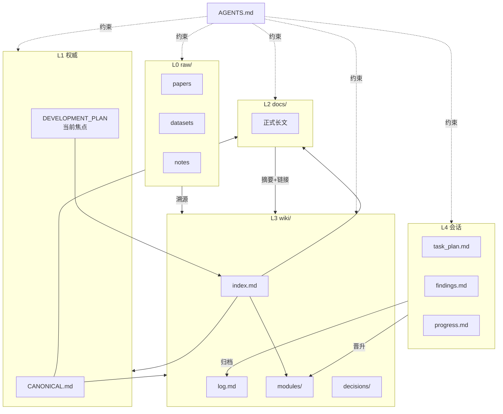

# 面向 LLM 协作的项目文档管理架构

> 本文总结 Politeia 项目的文档管理实践，并抽象为可推广到其他研究型/复杂软件项目的通用方法。
> 项目内约定细则见根目录 [AGENTS.md](../AGENTS.md)；本仓库实例见 [wiki/index.md](../wiki/index.md)。

---

## 1. 要解决什么问题

在 AI Agent 参与开发时，常见失败模式包括：

| 问题 | 根因 |
|------|------|
| Agent「编造」领域事实 | 没有权威源与溯源约定 |
| 上下文窗口丢失后失忆 | 重要信息只存在于对话里 |
| 文档与代码漂移 | 没有模块索引与时间线 |
| 正式文档被 wiki 碎片化 | 把所有内容塞进 Agent 友好格式 |
| 复杂任务半途而废 | 缺少会话级任务追踪 |

本架构用**分层存储 + 明确权威 + 可操作流程 + 会话工作记忆**应对上述问题。

---

## 2. 核心思想（一句话）

> **原始资料只读归档，权威规格单点维护，正式文档写给人看，wiki 写给 Agent 导航，会话文件写给当前任务。**

灵感来源：Karpathy 的 [LLM Wiki](https://github.com/karpathy/llm-wiki) 模式；Politeia 在此基础上增加了 `docs/` 正式层与会话级 planning。

---

## 3. 五层文档模型

将仓库文档按**生命周期**与**读者**划分，而非按文件格式划分。

```
项目根/
├── raw/              # L0 原始层 — 只读归档
├── <CANONICAL>.md    # L1 权威层 — 领域「宪法」（单点真相）
├── docs/             # L2 正式层 — 成体系参考文档
├── wiki/             # L3 导航层 — Agent 索引、摘要、ADR、模块速查
├── AGENTS.md         # Schema — 告诉 Agent 如何维护以上各层
├── DEVELOPMENT_PLAN  # L1 配套 — 工程计划（围绕权威层）
├── CODE_GUIDE        # L2/L3 配套 — 代码总览（模块拆分到 wiki/modules/）
│
├── task_plan.md      # L4 会话层 — 当前任务（可选，通常 gitignore）
├── findings.md
└── progress.md
```

### 3.1 各层职责（通用定义）

| 层级 | 目录/文件 | 可变性 | 主要读者 | 职责 |
|------|-----------|--------|----------|------|
| **L0 原始** | `raw/` | 只追加，不篡改 | 人 + Agent（引用） | 论文、数据集说明、会议笔记、外部导出 |
| **L1 权威** | 根目录 1 份「宪法」文档 | 活文档，变更需领域审阅 | 全员 + Agent | 问题定义、核心模型/架构、不可随意改的参数 |
| **L2 正式** | `docs/` | 正常版本管理 | 人为主，Agent 辅助 | 设计说明、构建指南、公式清单、长文论述 |
| **L3 导航** | `wiki/` | Agent 与人共同维护 | Agent 为主 | 索引、时间线、概念/实体/模块摘要、ADR |
| **L4 会话** | 根目录三文件 | 任务结束可删 | 当前 Agent 会话 | 阶段计划、临时发现、操作日志 |
| **Schema** | `AGENTS.md` | 随流程演进 | Agent | 层级说明、操作类型、页面模板、禁忌 |

### 3.2 映射到 Politeia（实例）

| 通用 | Politeia |
|------|----------|
| L1 权威文档 | `research-proposal.md`（物理模型唯一权威源） |
| L1 工程计划 | `DEVELOPMENT_PLAN.md` |
| L2 正式文档 | `docs/stochastic-distributions.md`、`docs/parallel-framework-design.md` 等 |
| L3 导航 wiki | `wiki/index.md`、`wiki/log.md`、`wiki/modules/` … |
| L4 会话规划 | `task_plan.md`、`findings.md`、`progress.md`（[planning-with-files](https://github.com/OthmanAdi/planning-with-files)） |

### 3.3 映射到其他项目类型

| 项目类型 | L1 权威文档建议命名 | L1 审阅门槛 |
|----------|---------------------|-------------|
| 科研仿真 | `SPEC.md` / `model-spec.md` | 公式、参数需 PI 确认 |
| 后端 API | `API-contract.md` / OpenAPI 为主 + 摘要 | 破坏性变更需评审 |
| 前端产品 | `PRD.md` | 需求变更需产品确认 |
| 基础设施 | `architecture.md` | SLO/安全相关需 SRE 确认 |

**原则**：全仓库只有**一处**「宪法」；其他文档必须与之对齐，Agent 不得擅自改写宪法中的核心约束。

---

## 4. docs/ 与 wiki/ 的分工（关键）

这是最容易做错的地方。

| | `docs/` | `wiki/` |
|---|---------|---------|
| **目的** | 可读、可评审、可引用的正式文档 | Agent 快速定位与跨链 |
| **篇幅** | 允许长文 | 宜短：摘要 + 链接 |
| **是否搬全文** | 否 — wiki **不**承担全文仓库 | |
| **典型内容** | 设计文档、教程、公式推导 | `index.md`、`log.md`、模块一页纸、ADR |
| **更新触发** | 功能/设计定型时 | 每次 ingest、change、decision |

> **反模式**：把 `docs/` 全部复制进 wiki → 双份维护、必然漂移。  
> **正模式**：wiki 写「见 `[[docs/foo]]`」+ 三行摘要。

---

## 5. wiki/ 内部结构（推荐最小集）

```
wiki/
├── index.md       # 全局索引（Agent 入口，必读）
├── log.md         # 时间线（append-only 事件流）
├── concepts/      # 领域概念（可选）
├── entities/      # 数据集、工具、外部系统（可选）
├── modules/       # 代码模块速查（与 CODE_GUIDE 拆分对应）
└── decisions/     # ADR 风格设计决策（可选）
```

### 5.1 `index.md`

- 每个重要页面**一行摘要**
- 按类别分表（核心文档 / 物理 / 构建 / 模块 / 工具…）
- 链到 `docs/` 与根目录权威文档，而非复制内容

### 5.2 `log.md`

统一事件格式，便于 `grep` 与 Agent 快速扫描：

```markdown
## [YYYY-MM-DD] <类型> | <标题>
- 要点 1
- 要点 2
```

**类型**（可扩展，建议保持 ≤6 种）：

| 类型 | 何时写 |
|------|--------|
| `ingest` | 新资料、新依赖、新论文入库 |
| `change` | 代码或文档合并级变更 |
| `decision` | 架构/技术选型落定 |
| `query` | 有价值的分析结论值得存档 |
| `lint` | 定期健康检查（链接、一致性、模块偏差） |

### 5.3 页面模板（精简）

**概念页** — 定义 + 项目内实现 + 来源链接  
**实体页** — 类型 + 用途 + 官方/ raw 参考  
**模块页** — 代码路径 + 职责 + 关键 API + 链到权威章节  
**决策页（ADR）** — 背景 / 决定 / 理由 / 后果 / 状态

完整模板见 [AGENTS.md](../AGENTS.md#wiki-页面格式约定)。

---

## 6. 五条核心原则

### 6.1 单点权威（Single Source of Truth）

- 领域核心事实只存在于 L1
- L2 的公式、参数、接口必须与 L1 **一致**
- Agent 可做**交叉检查**，不可擅自修改需人审的内容

### 6.2 溯源（Provenance）

- 引用 `raw/`：标注文件名、章节、页码
- 引用 L1：使用 `[[CANONICAL#章节]]` 或相对路径
- 不确定：标注 `[待确认]`，禁止写成定论

### 6.3 不编造（No hallucinated facts）

- wiki 中的「事实」必须能追溯到 L0/L1/L2 或当次实验输出
- 分析性结论写入 `query` 类 log，并标明假设

### 6.4 索引驱动（Index-first）

- Agent 接到问题：先读 `wiki/index.md` → 再读目标页 → 再读 `docs/` 长文
- 避免无差别全文扫描仓库

### 6.5 晋升与归档（Promote & archive）

会话结束时的信息流：

```
task_plan.md / findings.md / progress.md
        │
        ├─► wiki/log.md          （事件摘要）
        ├─► wiki/concepts/       （稳定概念）
        ├─► wiki/decisions/      （若产生 ADR）
        └─► docs/ 或 L1          （仅当需要正式化长文时）
```

---

## 7. 操作流程（Agent 工作流）

以下五类操作应写进项目的 `AGENTS.md`，作为 Agent 的「运维手册」。

| 操作 | 触发 | 必做步骤 |
|------|------|----------|
| **Ingest** | 新论文、新数据、新依赖 | raw 入库 → 更新 wiki 页 → `index.md` → `log.md` ingest |
| **Change** | 功能/修复合并 | 更新 `wiki/modules/`（若涉及）→ `log.md` change |
| **Decision** | 技术选型落定 | **先** `wiki/decisions/ADR-xxx` **再** `log.md` 索引行（禁止只写 log） |
| **Query** | 深度分析有价值 | 可选概念页 → `log.md` query |
| **Lint** | 定期或发版前 | 孤立页、过时声明、L2 与 L1 不一致、模块与代码偏差 → `log.md` lint |

---

## 8. 会话级规划（L4）与 Cursor 集成

复杂任务（多步骤、跨会话、大量工具调用）使用 [planning-with-files](https://github.com/OthmanAdi/planning-with-files)：

| 文件 | 作用 |
|------|------|
| `task_plan.md` | 阶段、状态、决策表、错误表 |
| `findings.md` | 研究发现（遵守 2-Action Rule：每两次检索就写入） |
| `progress.md` | 操作与测试结果日志 |

配合 `.cursor/hooks.json`：在工具调用前后注入计划、提醒更新、检查阶段是否完成。

**与 L3 的关系**：L4 是 RAM，L3 是磁盘；任务结束前必须把值得保留的内容**晋升**到 `wiki/log.md`，否则下一会话仍会失忆。

---

## 9. AGENTS.md：项目的「文档 Schema」

`AGENTS.md` 不是给人读的介绍，而是 **Agent 契约**，应包含：

1. 目录树与各层职责  
2. docs vs wiki 分工表  
3. L1 权威文档名称与审阅规则  
4. 五类操作（ingest / change / decision / query / lint）检查清单  
5. wiki 页面模板  
6. `log.md` 格式  
7. 会话规划（L4）与归档规则  
8. 项目特殊禁忌（如：禁止 Agent 改动物理公式）

**推广时**：复制 [AGENTS.md](../AGENTS.md) 结构，替换项目名称、权威文档名、审阅门槛即可。

---

## 10. 与其他常见做法的对比

| 做法 | 优点 | 与本架构关系 |
|------|------|----------------|
| 仅 README | 简单 | 不足以支撑长期 Agent 协作 |
| 全 monorepo 文档站（MkDocs/Docusaurus） | 对人友好 | 保留为 `docs/`；wiki 做轻量索引 |
| 仅 Cursor Rules | 编码规范 | 互补；Rules 管风格，AGENTS.md 管知识库 |
| 仅 planning-with-files | 任务追踪 | 作为 L4；须归档到 wiki |
| Notion/飞书 | 协作编辑 | 可作 raw 或 L2 导出源，权威仍建议进 git |

---

## 11. 成熟度模型：文档强 vs 任务弱

许多项目（含 Politeia 早期）会落在 **「文档 ★★★★★ / 任务 ★★☆☆☆」** 象限：

| 象限 | 特征 | 风险 |
|------|------|------|
| 文档强、任务弱 | `log` 丰富、`DEVELOPMENT_PLAN` 详尽，但无 Issue/无 `task_plan` | Agent 知道「项目是什么」，不知道「这周做什么」 |
| 任务强、文档弱 | 看板齐全，无权威源 | Agent 易编造领域事实 |
| 双强 | L0–L4 + 当前焦点 + ADR + 定期 lint | 推荐目标 |
| 双弱 | 仅 README | 仅适合玩具项目 |

**改进不必换工具**：在现有架构上补四块——**Git 工作流写清**、**当前焦点**、**ADR 正文目录**、**L4 实际使用**。

---

## 12. Git 与版本控制（执行层）

此前文档侧重「知识分层」，容易让人以为项目管理只靠 markdown。**实际上 Git 始终是代码与入库文档的执行真相**；wiki / L4 是解释层，不是替代品。

### 12.1 三者分工

| 载体 | 回答的问题 | 粒度 | 是否版本化 |
|------|------------|------|------------|
| **Git**（commit / branch / tag） | 改了什么、何时、谁、能否回滚 | 每次提交 | ✅ |
| **`wiki/log.md`** | 为什么改、业务含义、实验结论 | 事件/功能 | ✅（随仓库） |
| **L4 三文件** | 当前会话做到哪一步 | 单次任务 | 通常 gitignore |

```
         ┌─────────────────────────────────────┐
         │  Git：可合并、可审查、可回滚的执行史   │
         │  src/ docs/ wiki/ AGENTS.md …       │
         └──────────────┬──────────────────────┘
                        │ merge 后
                        ▼
              wiki/log.md 记一条 change（语义摘要）
                        │
         ┌──────────────┴──────────────────────┐
         │  L4 task_plan（会话 RAM，可选）       │
         └─────────────────────────────────────┘
```

- **`git log` / `git diff`**：查具体行级变更  
- **`wiki/log.md`**：查「5 月 10 日人口爆炸修复」这类叙事  
- 二者**互补**，不应只维护其一

### 12.2 推荐 Git 工作流（通用）

| 元素 | 作用 | 与本文架构的挂钩 |
|------|------|------------------|
| **分支** | 隔离进行中的工作 | `feature/…` 对应「当前焦点」或 L4 的一项 |
| **Commit** | 原子变更单元 | message 可带 `change:` / `fix:`；合并后写 log |
| **PR / MR** | 审查、CI、讨论 | 描述里链 `Fixes #12`；合并触发 log 更新 |
| **Issue** | 任务状态、责任人 | label 对齐 `ingest/change/decision`（可选） |
| **Tag / Release** | 里程碑、可复现算例 | 对应 Phase 完成或论文复现包 |

**最小闭环（单人项目也适用）**：

1. `git checkout -b feature/river-validation`
2. 复杂任务时建 L4 `task_plan.md`
3. 小步 commit，message 说明意图
4. 合并到 `main`（或 PR 自审后 merge）
5. 追加 `wiki/log.md`：`## [日期] change | …`（可附 commit hash：`abc1234`）
6. 删除或归档 L4 三文件

### 12.3 什么进 Git、什么不进

| 进 Git | 通常不进 Git（.gitignore） |
|--------|---------------------------|
| `src/`、`docs/`、`wiki/`、`AGENTS.md`、ADR | `task_plan.md`、`findings.md`、`progress.md`（L4 会话） |
| `examples/*.cfg`、小体积样例数据 | 大型 IC/输出（`examples/*_output/`、数百 MB CSV） |
| `research-proposal.md`（需审阅的变更） | 含密钥的 `env.sh`、本地路径 |

**原则**：需要**协作、回滚、复现**的 → Git；仅**当前对话**的草稿 → L4 或本地。

### 12.4 Politeia 实例（Git 实践）

| 项 | 做法 |
|----|------|
| 远程 | GitHub `ONE-ZERO-01/Politeia` |
| 分支 | `main`（对外：代码 + README）/ `dev`（本地：含 wiki、大文件路径等全量） |
| 推送 | `push.sh`：`dev` → 同步到 `main` 再推送 |
| CI | 暂无 `.github/workflows`（测试靠本地 `ctest`） |
| Issues | 未强制；任务靠「当前焦点」+ `wiki/log` |

详见 [[wiki/log#2026-05-08] change | 项目推送 GitHub + 分支管理]。

### 12.5 与 Agent 协作时的 Git 习惯

- 开工前：`git status` + `git diff --stat`（planning-with-files 会话恢复也建议做）
- 物理/公式变更：除 commit 外，**必须**人审 `research-proposal.md`
- Agent 完成有意义合并后：**提醒**写 `wiki/log.md`，不要假设 commit message 够用了
- 发版/论文复现：打 `git tag`，在 log 写 `change | release vX.Y` 并注明 tag 名

---

## 13. 任务级项目管理（补短板）

路线图（`DEVELOPMENT_PLAN.md`）回答「全生命周期」；**当前焦点**回答「现在做什么」。

### 13.1 「当前焦点」小节（模板）

放在 `DEVELOPMENT_PLAN.md` 或独立 `FOCUS.md` 最顶部，**每周或每阶段更新**：

```markdown
## 当前焦点（活跃项）

| 优先级 | 项 | 状态 | 说明 |
|--------|-----|------|------|
| P0 | … | 进行中 | … |
| P1 | … | 待 | … |

**阻塞**：…
**上次更新**：YYYY-MM-DD
```

规则：
- 仅保留 3–5 条 **未完成** 项；完成项删掉并写入 `wiki/log.md`
- Agent 接到任务时**先读当前焦点**，再决定是否打开 Phase 全文
- 与 L4 `task_plan.md` 关系：焦点 = 战略队列；task_plan = 单次会话战术

### 13.2 ADR 与 log 的双写规则

| 载体 | 写什么 | 篇幅 |
|------|--------|------|
| `wiki/decisions/ADR-NNN-*.md` | 背景、选项对比、决定、后果 | 1–2 页 |
| `wiki/log.md` `decision` 行 | 标题 + 链到 ADR | 2–5 行 |

**反模式**：`log.md` 里写满决策细节但 `wiki/decisions/` 为空 → 无法深读、无法版本对比。

### 13.3 L4 不是「装了就完事」

| 状态 | 含义 |
|------|------|
| 仅安装 skill/hooks | 能力就绪，实践为零 |
| 复杂任务创建三文件 | 合格 |
| 任务结束归档到 `wiki/log.md` | 闭环 |

**强制使用 L4 的场景**（写入 `AGENTS.md`）：多文件重构、跨会话调试、文献 ingest、>5 次工具调用的实现。

### 13.4 可选：GitHub Issues

| 规模 | 建议 |
|------|------|
| 单人 / 双人 | 当前焦点 + L4 足够 |
| 3+ 人 | Issue 映射 Phase，label 对齐 `ingest/change/decision`；wiki 只链 Issue 号 |

Issues 管**责任与状态**；wiki 管**知识与溯源**——不要重复描述需求正文。

### 13.5 反思文档的索引纪律

`reflection-*.md`、`lessons-learned.md`、`troubleshooting.md` 易膨胀。

- 新反思 → 必须在 `wiki/index.md`「反思与教训」表登记**一行摘要**
- 可复用原则 → 提炼进 `lessons-learned.md`，链回来源 reflection
- 禁止：磁盘上 10+ 篇 reflection 但 index 未更新

---

## 14. 新项目上线路线图

### 阶段 A：最小可用（1 天）

- [ ] 创建 `AGENTS.md`（从本文 §9 提纲）
- [ ] 确定 L1 权威文档文件名并写目录大纲
- [ ] 创建 `wiki/index.md`、`wiki/log.md`
- [ ] 创建 `raw/` 与 `docs/` 空目录 + README 说明
- [ ] 初始化 Git；约定默认分支与 `.gitignore`（含 L4 三文件、大输出）
- [ ] `DEVELOPMENT_PLAN` 顶部写「当前焦点」（哪怕只有 1 条）

### 阶段 B：与代码对齐（1–2 周）

- [ ] 为每个 `src/` 子目录添加 `wiki/modules/<name>.md`
- [ ] 将现有 README / 设计 doc 迁入 `docs/`，在 index 建链
- [ ] 跑第一次 `lint`，修孤立页与断链
- [ ] 将历史重要决策补写为 ADR（可后补）

### 阶段 C：Agent 增强

- [ ] 安装 `planning-with-files` 到 `.cursor/skills/`
- [ ] 配置 `hooks.json`；gitignore 会话三文件
- [ ] 在 AGENTS.md 写明 L4 → L3 归档规则与**强制场景**
- [ ] **用真实复杂任务跑通一次** L4 → log 归档（验收标准）

### 阶段 D：持续运营

- [ ] 每次 merge / 有意义 commit 批次 → `log.md` change（可附 commit hash）
- [ ] 每次架构决策 → **先** ADR，**再** log 索引行
- [ ] 发版前或每季度 → `lint` 写入 log
- [ ] 每周扫一眼「当前焦点」是否过时

---

## 15. 检查清单（Lint 模板）

Agent 或人可定期执行：

- [ ] `wiki/index.md` 是否覆盖所有活跃 `docs/` 与模块？
- [ ] 是否存在**无入链**的 wiki 页？
- [ ] L2 中与 L1 相关的公式/参数是否一致？
- [ ] `wiki/modules/` 路径是否与 `src/` 实际结构一致？
- [ ] `log.md` 最近是否有对应重大 merge 的条目？
- [ ] 根目录是否残留过期的 `task_plan.md` 未归档？
- [ ] `DEVELOPMENT_PLAN`「当前焦点」是否与事实一致？
- [ ] 每个 `decision` log 条目是否都有对应 `wiki/decisions/ADR-*`？
- [ ] `reflection-*.md` 是否均在 `wiki/index.md` 登记？
- [ ] planning-with-files 是否**实际使用**（而非仅安装）？

---

## 16. 架构一览图



---

## 17. 常见反模式（来自真实项目）

| 反模式 | 症状 | 修复 |
|--------|------|------|
| **空 decisions/** | log 有 decision，无 ADR | 后补 ADR-001…，log 改为一行+链接 |
| **Skill 僵尸化** | 装了 planning-with-files，从未建 task_plan | AGENTS 写强制场景；验收一次归档 |
| **计划百科全书** | DEVELOPMENT_PLAN 上千行无人读 | 顶部「当前焦点」3–5 条 |
| **反思孤岛** | reflection 文件增多，index 未登记 | index 专表 + lessons-learned 提炼 |
| **Lint 从未执行** | AGENTS 写了 lint，log 无 lint 类型 | 季度/发版前跑 §15 清单 |
| **双份 docs** | wiki 复制 docs 全文 | 只保留摘要+`[[docs/...]]` |
| **只 commit 不写 log** | `git log` 有记录，wiki 无叙事 | merge 后补 `wiki/log.md` change |
| **log 不写 commit** | 无法从 log 跳到 diff | log 条目附 `commit: abc1234` 或 PR 链接 |

---

## 18. Politeia 实例快照（2026-05-19）

| 能力 | 状态 |
|------|------|
| L0–L3 分层 | ✅ 运转中 |
| `wiki/log.md` 变更史 | ✅ 密集 |
| `wiki/decisions/` ADR | ✅ ADR-001–003（自 log 后补） |
| `DEVELOPMENT_PLAN` 当前焦点 | ✅ 已加 |
| L4 planning-with-files | ⚠️ 已安装，待复杂任务实战 |
| 定期 lint | ✅ 2026-05-19 首轮（见 log） |
| `wiki/modules/` vs `src/` | ✅ 已补 river、climate |
| Git 工作流文档化 | ✅ 本文 §12；实践：`main`/`dev` + `push.sh` |
| GitHub Issues / CI | ⚠️ 未启用 |

---

## 19. 参考

- Politeia 实例：[AGENTS.md](../AGENTS.md)、[wiki/index.md](../wiki/index.md)、[DEVELOPMENT_PLAN.md](../DEVELOPMENT_PLAN.md)（当前焦点）
- ADR 示例：[wiki/decisions/ADR-001-docs-wiki-split.md](../wiki/decisions/ADR-001-docs-wiki-split.md)
- Karpathy LLM Wiki 思路（概念层）
- [planning-with-files](https://github.com/OthmanAdi/planning-with-files)（会话 L4）
- [Architecture Decision Records](https://cognitect.com/blog/2011/11/15/documenting-architecture-decisions)

---

*文档版本：2026-05-19 v3 · 增补 Git 执行层（§12）与 commit/log 双写约定*
