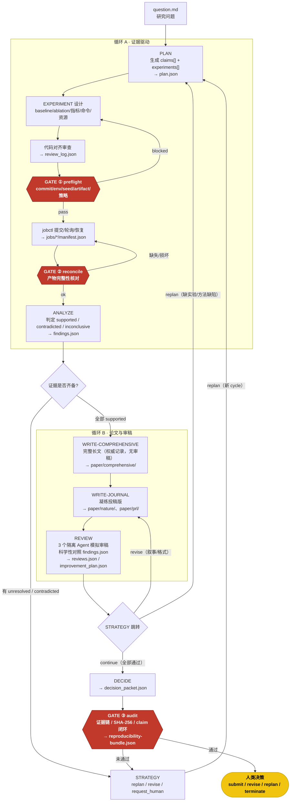
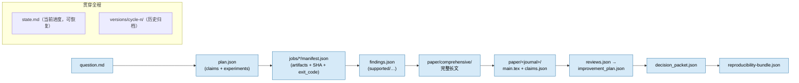
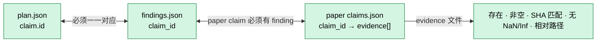
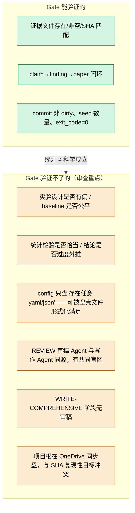

# AutoResearcher 框架设计图

> 用于审查框架合理性。所有图为 Mermaid，可在 Cursor / GitHub / VS Code 直接预览。
> 图例：矩形=Stage（LLM 做判断）｜菱形=分支决策｜双圈/红色=Gate（确定性代码，不可绕过）｜圆角=人类介入。

---

## 1. 总览：两循环 + 三 Gate + 人类边界

---

## 2. 职责分层：谁做判断，谁做验证

```mermaid
flowchart LR
    subgraph L1["① LLM Agent（科学判断）"]
        direction TB
        a1["提出/收缩/重写 claim"]
        a2["设计实验、选算法、调参数"]
        a3["解释证据、判定结论"]
        a4["写论文、模拟审稿、给决策建议"]
    end

    subgraph L2["② Foundation 工具（确定性验证 · 不做科学判断）"]
        direction TB
        g1["preflight：复现前置约束"]
        g2["jobctl：幂等提交 / 崩溃恢复"]
        g3["audit：证据链完整性"]
    end

    subgraph L3["③ 人类（边界决策）"]
        direction TB
        h1["预算：token / GPU-hour / cycle"]
        h2["权限：账号 / 数据 / 主机 / 许可"]
        h3["发布：最终投稿 / 终止"]
    end

    L1 -- "产出 JSON 契约" --> L2
    L2 -- "pass=放行 / blocked=打回" --> L1
    L1 -- "request_human / stop_request" --> L3
    L3 -- "批准预算·权限·发布" --> L1

    classDef box fill:#ecf0f1,stroke:#95a5a6,color:#000;
    class L1,L2,L3 box;
```

---

## 3. 产物链（可复现的证据传递）

audit 强制校验的三层 ID 闭环（任一断裂即 blocked）：

---

## 4. 审查关注点（已知薄弱环节，标注在图上）

